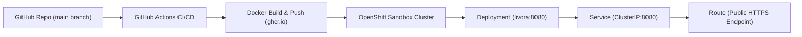

# 🚀 Red Hat OpenShift Developer Sandbox Deployment Guide

This guide walks you through deploying **Livora** to the free **Red Hat OpenShift Developer Sandbox** using automated **GitHub Actions CI/CD** (recommended) or the **OpenShift Web Console**.

---

## 📋 Architecture Overview



---

## 🌟 Method 1: Automated Deployment via GitHub Actions (Recommended)

### Step 1: Obtain Your OpenShift Sandbox Login Token

1. Go to the [Red Hat OpenShift Developer Sandbox](https://developers.redhat.com/developer-sandbox) and log in.
2. Launch your sandbox environment (opens the OpenShift Web Console).
3. In the top-right corner of the OpenShift Console, click your username and select **"Copy login command"**.
4. In the new tab, click **"Display Token"**.
5. You will see a command like this:
   ```bash
   oc login --token=sha256~AbCdEf1234567890 --server=https://api.sandbox-m2.ll9k.p1.openshiftapps.com:6443
   ```
6. Extract the 3 values:
   - **`OPENSHIFT_SERVER`**: The URL after `--server=` (e.g. `https://api.sandbox-m2.ll9k.p1.openshiftapps.com:6443`)
   - **`OPENSHIFT_TOKEN`**: The token after `--token=` (e.g. `sha256~AbCdEf1234567890`)
   - **`OPENSHIFT_NAMESPACE`**: Your dev project name shown in the OpenShift console (e.g. `bilbin10-glitch-dev`)

---

### Step 2: Add Secrets to GitHub

1. Open your GitHub repository settings:
   👉 **[https://github.com/bilbin10-glitch/livora/settings/secrets/actions](https://github.com/bilbin10-glitch/livora/settings/secrets/actions)**
2. Click **"New repository secret"** and create each of the following:

| Secret Name | Value | Description |
| :--- | :--- | :--- |
| `OPENSHIFT_SERVER` | `https://api.sandbox-m2.ll9k.p1.openshiftapps.com:6443` | OpenShift API Cluster URL |
| `OPENSHIFT_TOKEN` | `sha256~AbCdEf1234567890` | Personal Access Token |
| `OPENSHIFT_NAMESPACE` | `bilbin10-glitch-dev` | Your Sandbox dev namespace/project |

---

### Step 3: Trigger the Workflow

1. Go to the **Actions** tab on GitHub:
   👉 **[https://github.com/bilbin10-glitch/livora/actions](https://github.com/bilbin10-glitch/livora/actions)**
2. Click **"Build & Deploy to Red Hat OpenShift Sandbox"** in the left sidebar.
3. Click **"Run workflow"** → Select branch **`main`** → Click **"Run workflow"**.
4. The workflow will automatically:
   - Build the multi-stage Docker container.
   - Push to GitHub Container Registry (`ghcr.io`).
   - Authenticate with OpenShift Sandbox.
   - Apply `openshift/deployment.yaml`, `openshift/service.yaml`, and `openshift/route.yaml`.
   - Output your live HTTPS application URL!

---

## 🌐 Method 2: Direct 1-Click Deployment via OpenShift Web Console

If you prefer deploying directly from the OpenShift Web UI:

1. Open your [OpenShift Developer Sandbox Console](https://developers.redhat.com/developer-sandbox).
2. Ensure you are in the **Developer** perspective (top-left dropdown).
3. Click **"+Add"** in the left sidebar.
4. Select **"Import from Git"**.
5. Fill in the form:
   - **Git Repo URL**: `https://github.com/bilbin10-glitch/livora.git`
   - **Git Reference**: `main`
   - **Build Option**: Select **Dockerfile** (OpenShift automatically detects the `Dockerfile` at the root).
   - **Application Name**: `livora-app`
   - **Name**: `livora`
   - **Target Port**: `8080`
   - **Routing**: Ensure **"Secure Route"** (TLS Termination: `Edge`) is checked.
6. Click **"Create"**.
7. OpenShift will clone the repository, build the image, start the pod, and generate your live public Route!

---

## 🔍 How to Monitor & Verify Deployment

### View Pods & Logs in OpenShift
1. In the OpenShift Console, go to **Topology**.
2. Click on the circular **livora** deployment pod icon.
3. Click **"Logs"** under the Pod details panel to view real-time server output:
   ```text
   🚀 LIVORA ENTERPRISE ENGINE RUNNING ON PORT 8080
   📡 URL: http://localhost:8080/api/health
   🔒 Security: Rate Limiting, XSS Protection & Atomic File Locks Enabled
   ```

### Test API Health Check
Visit the `/api/health` endpoint on your live Route:
```bash
curl https://<YOUR_OPENSHIFT_ROUTE_URL>/api/health
```
Response:
```json
{
  "status": "online",
  "server": "Livora Enterprise Core Engine",
  "version": "2.0.0-production",
  "port": 8080
}
```
